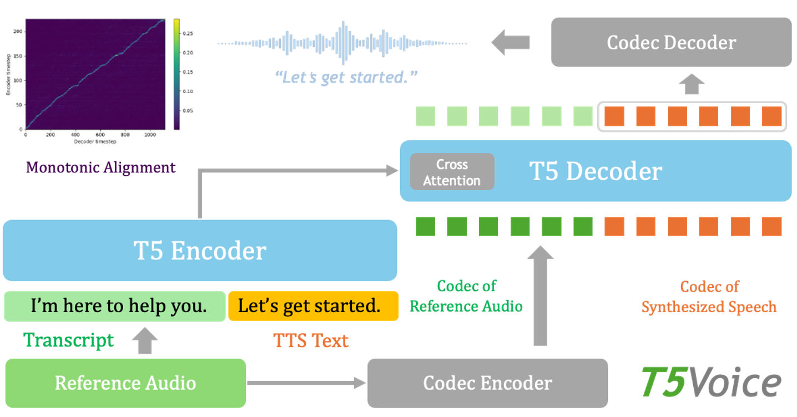
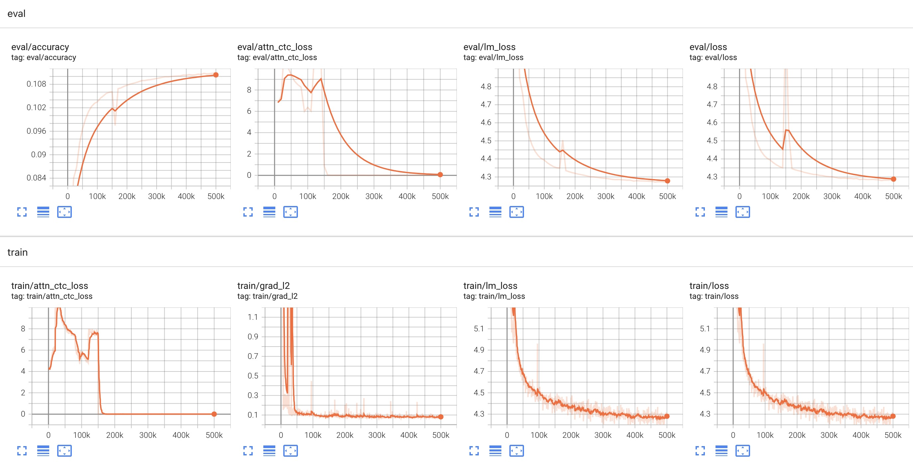
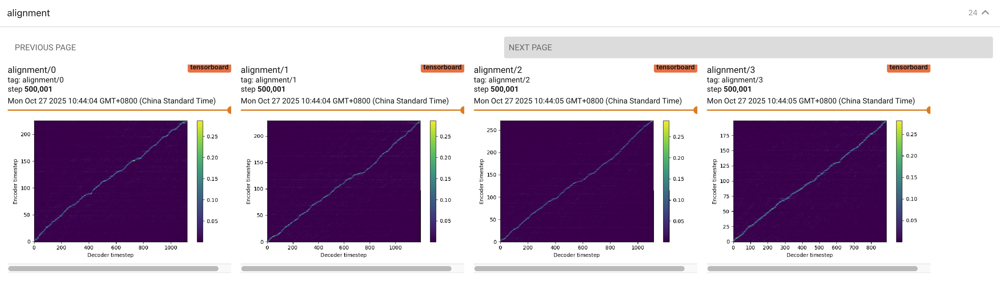
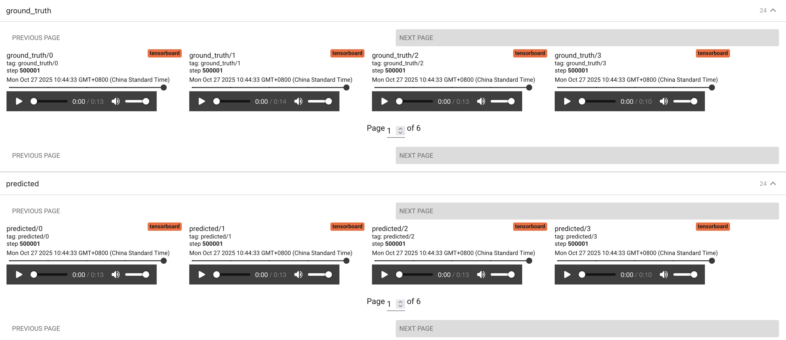

# T5Voice

[](https://www.python.org/)
[](https://pytorch.org/)
[](LICENSE)

T5Voice is a lightweight PyTorch implementation of T5-based text-to-speech synthesis (also known as T5-TTS), supporting both streaming and non-streaming speech synthesis with zero-shot capabilities.

Recent studies [[1]](#1)[[2]](#2) have shown that T5-based text-to-speech models can generate highly natural and intelligible speech by learning monotonic alignment over discrete audio codecs. We introduce T5Voice for researchers and developers to easily reproduce the training and inference processes of T5-TTS, and to extend it for further experiments and applications.

## Features

- **High-Quality Speech**: Generate natural-sounding speech using T5-based architecture
- **Zero-Shot Synthesis**: Zero-shot speech synthesis using only a few seconds of reference audio
- **Streaming Generation**: Real-time low-latency streaming generation with configurable chunk size
- **Multi-GPU Support**: Multi-GPU training support with Accelerate for faster model training
- **Easy Deployment**: One-key deployment on NVIDIA GPUs based on Triton Inference Server

## Table of Contents

- [Architecture](#architecture)
- [Environment Setup](#environment-setup)
- [Dataset Preparation](#dataset-preparation)
- [Data Preprocessing](#data-preprocessing)
- [Filelist Generation](#filelist-generation)
- [Training](#training)
- [Inference](#inference)
- [Monitoring](#monitoring)
- [Deployment](#deployment)
- [Checkpoints](#checkpoints)
- [Audio Samples](#audio-samples)
- [Citation](#citation)
- [Acknowledgements](#acknowledgements)
- [Contact](#contact)
- [References](#references)


## Architecture

T5Voice adapts the T5 architecture for text-to-speech synthesis. The model treats speech generation as a sequence-to-sequence task: text is first transformed into discrete audio codec tokens, then converted back to waveforms via an audio codec model. T5Voice also uses the attention prior and alignment CTC loss proposed in [[1]](#1) to accelerate the learning of monotonic alignment.

### Key Components

- **T5 Encoder**: Encodes the input text (reference audio transcript concatenated with text to synthesize) into encoded features
- **T5 Decoder**: Autoregressively generates codec tokens conditioned on encoded features and codec tokens of the reference audio
- **Codec Encoder**: Converts waveforms at 22kHz into codec tokens. Used to extract codec tokens from the reference audio.
- **Codec Decoder**: Converts codec tokens back to waveforms at 22kHz. Used to convert synthesized codec tokens to waveforms.



## Environment Setup

```bash
# Create and activate conda environment
conda create --name t5voice python==3.10.12
conda activate t5voice

# Install system dependencies
apt install libsndfile1-dev espeak-ng -y

# Install Python dependencies
pip install -r requirements.txt
```

## Dataset Preparation

Download the LibriTTS and Hi-Fi TTS datasets:

```bash
# LibriTTS
bash t5voice/preprocess/download_libritts.sh ./datasets/libritts

# Hi-Fi TTS
bash t5voice/preprocess/download_hifitts.sh ./datasets/hifitts
```

## Data Preprocessing

Preprocess the datasets to extract mel codec features:

```bash
# Hi-Fi TTS
python -m t5voice.preprocess.preprocess_hifitts \
  --dataset-dir=./datasets/hifitts/hi_fi_tts_v0 \
  --output-dir=./datasets/hifitts/hi_fi_tts_v0/codec \
  --codec-model=mel_codec_22khz_medium \
  --batch-size=32

# LibriTTS
python -m t5voice.preprocess.preprocess_libritts \
  --dataset-dir=./datasets/libritts/LibriTTS/ \
  --output-dir=./datasets/libritts/LibriTTS/codec \
  --codec-model=mel_codec_22khz_medium \
  --batch-size=32
```

## Filelist Generation

Generate train/dev/test splits for each dataset:

```bash
# Hi-Fi TTS
mkdir -p ./t5voice/filelists/hifitts/
python -m t5voice.generate_filelists \
  --dataset_name=hifitts \
  --dataset_dir=./datasets/hifitts/hi_fi_tts_v0/ \
  --codec_dir=codec \
  --train_filelist=./t5voice/filelists/hifitts/train_filelist.txt \
  --test_filelist=./t5voice/filelists/hifitts/test_filelist.txt \
  --dev_filelist=./t5voice/filelists/hifitts/dev_filelist.txt

# LibriTTS
mkdir -p ./t5voice/filelists/libritts/
python -m t5voice.generate_filelists \
  --dataset_name=libritts \
  --dataset_dir=./datasets/libritts/LibriTTS/ \
  --codec_dir=codec \
  --train_filelist=./t5voice/filelists/libritts/train_filelist.txt \
  --test_filelist=./t5voice/filelists/libritts/test_filelist.txt \
  --dev_filelist=./t5voice/filelists/libritts/dev_filelist.txt
```

## Training

### Single-GPU Training

```bash
python -m t5voice.main --config-name=t5voice_base_libritts_hifitts
# or
bash train.sh
```

### Multi-GPU Training

```bash
accelerate launch -m t5voice.main --config-name=t5voice_base_libritts_hifitts
# or
bash train_multi_gpu.sh
```

### Resume Training from Checkpoint

```bash
python -m t5voice.main \
  --config-name=t5voice_base_libritts_hifitts \
  model.restore_from=./logs/[DATE_DIR]/[TIME_DIR]/checkpoint-pt-10000/
```

## Inference

### Non-Streaming Synthesis

```bash
python -m t5voice.inference \
    --config-name=t5voice_base_libritts_hifitts \
    hydra.run.dir=. \
    hydra.output_subdir=null \
    hydra/job_logging=disabled \
    hydra/hydra_logging=disabled \
    model.checkpoint_path="checkpoints/t5voice_base_libritts_hifitts/checkpoint-pt-250000/model.safetensors" \
    infer.use_logits_processors=true \
    infer.top_k=80 \
    infer.top_p=1.0 \
    infer.temperature=0.85 \
    +reference_audio_path="reference.wav" \
    +reference_audio_text_path="reference.txt" \
    +text_path="text.txt" \
    +output_audio_path="output_t5voice.wav" \
    +max_generation_steps=3000 \
    +use_cache=true \
    +streaming=false
```

### Streaming Synthesis

For streaming generation, set `streaming=true` and specify `chunk_size` and `overlap_size`:

```bash
python -m t5voice.inference \
    --config-name=t5voice_base_libritts_hifitts \
    hydra.run.dir=. \
    hydra.output_subdir=null \
    hydra/job_logging=disabled \
    hydra/hydra_logging=disabled \
    model.checkpoint_path="checkpoints/t5voice_base_libritts_hifitts/checkpoint-pt-250000/model.safetensors" \
    infer.use_logits_processors=true \
    infer.top_k=80 \
    infer.top_p=1.0 \
    infer.temperature=0.85 \
    +reference_audio_path="reference.wav" \
    +reference_audio_text_path="reference.txt" \
    +text_path="text.txt" \
    +output_audio_path="output_t5voice.wav" \
    +max_generation_steps=3000 \
    +use_cache=true \
    +streaming=true \
    +chunk_size=50 \
    +overlap_size=2

# or
bash inference.sh
```

## Monitoring

Monitor training progress using TensorBoard:

```bash
tensorboard --logdir=./logs/[DATE_DIR]/[TIME_DIR]/tensorboard/ --port=6007
```

Then open your browser and navigate to `http://localhost:6007` to view training metrics, losses, and sample outputs.

On the **SCALARS** tab, you can view all the training and evaluation loss curves.



On the **IMAGES** tab, you can view the alignment visualizations (decoder cross-attention weights).



A well-trained model should exhibit a clear monotonic alignment.

On the **AUDIO** tab, you can listen to the ground-truth audio samples and their corresponding generated (predicted) audio.



Note that the beginning of the predicted audio comes from the ground-truth audio and serves as the reference for the decoder. Please focus on the latter part of the audio to determine whether the model is able to generate intelligible speech.


## Deployment

T5Voice supports one-click accelerated streaming deployment on GPUs using NVIDIA TensorRT and the Triton Inference Server.

First, export your trained model to ONNX format:
```bash
bash export.sh
```
After export, you will obtain the following ONNX models: `t5_encoder.onnx`, `t5_decoder.onnx`, `codec_encode.onnx`, and `codec_decode.onnx`.

You can run inference directly with the ONNX models to verify their correctness:
```
bash inference_onnx.sh
```

Copy all ONNX models into the `deployment` directory and navigate to it:

```bash
cp *.onnx deployment && cd deployment
```

This process is based on the official NVIDIA Triton Inference Server image. It installs all dependencies, builds TensorRT engines, and saves the result as a new Docker image named `t5voice_tritonserver:latest`.

```bash
bash build_server.sh
```

Start the T5Voice server:
```bash
bash run_server.sh
```

Then, run the T5Voice client to send a TTS request to the server and receive streaming responses:

```bash
pip install requirements_client.txt
bash run_client.sh
```

If everything works correctly, you will see output similar to the following:

```yaml
[INFO] Running Triton client...

Server URL:     0.0.0.0:8001
Reference audio: reference.wav
Reference text:  I’m an assistant here to help with questions, provide information, and support you in various tasks,
Input text:      I can also offer suggestions, clarify complex topics, and make problem solving easier and more efficient.
Output file:     output.wav

Connected to Triton server at 0.0.0.0:8001
Model 't5voice' is ready
Loading reference audio from: reference.wav
Reference audio shape: (140238,)
Reference text: I’m an assistant here to help with questions, provide information, and support you in various tasks,
Target text: I can also offer suggestions, clarify complex topics, and make problem solving easier and more efficient.

Starting streaming inference...
============================================================
Chunks received: 11 | Time: 3.01s
============================================================
Streaming inference completed!

Saving audio to: output.wav

Statistics:
  Total chunks: 11
  Total samples: 138496
  Audio duration: 6.28 seconds
  Total time: 3.03 seconds
  First chunk latency: 296.65 ms
  Generation time: 2.70 seconds
  Real-time factor: 0.48

Done!

[INFO] Client request completed!
Generated audio saved to: output.wav
```

The first-chunk latency and real-time factor may vary depending on your GPU and CPU performance.

## Checkpoints

If you would like to access **pretrained checkpoints** or **pre-exported models** for testing T5Voice, please fill out the [form](https://forms.cloud.microsoft/r/p19ucjTcGd) to request access.

## Audio Samples

The following samples use different voices reading the sentence  
“I’m an assistant here to help with questions, provide information, and support you in various tasks.”  
as the **reference audio**, and synthesize the sentence  
“I can also offer suggestions, clarify complex topics, and make problem solving easier and more efficient.”

<details>
  <summary>🎧 Female 1 👩 Click to listen</summary>
  Reference:


https://github.com/user-attachments/assets/1fe05c5b-7fb8-4ee2-9cb7-0a0edab02290


  Synthesized:


https://github.com/user-attachments/assets/a1215714-2eb1-45ff-8c37-696cdd0e31cd


</details>

<details>
  <summary>🎧 Female 2 👩 Click to listen</summary>
  Reference:


https://github.com/user-attachments/assets/543d7eba-95f0-474f-96e9-80b55d530c58


  Synthesized:


https://github.com/user-attachments/assets/cae0a7f8-2a44-470c-abe7-61a9fd8ef839


</details>

<details>
  <summary>🎧 Female 3 👩 Click to listen</summary>
  Reference:


https://github.com/user-attachments/assets/09a2a569-5207-4341-9a83-d28e5c72d711


  Synthesized:


https://github.com/user-attachments/assets/bdb9b45c-5b37-489c-95c6-f0c18628b30f


</details>

<details>
  <summary>🎧 Male 1 👨 Click to listen</summary>
  Reference:


https://github.com/user-attachments/assets/e36c0bb6-f228-4884-adfe-1da1ec6dcb43


  Synthesized:


https://github.com/user-attachments/assets/eb64d263-9192-48b6-a490-53f557374180


</details>

<details>
  <summary>🎧 Male 2 👨 Click to listen</summary>
  Reference:


https://github.com/user-attachments/assets/e1a3d358-d316-42bd-894b-ef3805f4b628


  Synthesized:


https://github.com/user-attachments/assets/06d4f419-63e4-4d6f-aefb-ba3e64b7db02


</details>

<details>
  <summary>🎧 Male 3 👨 Click to listen</summary>
  Reference:


https://github.com/user-attachments/assets/99b41959-3862-4ca3-9f5c-e6caf7d4a2e5


  Synthesized:


https://github.com/user-attachments/assets/f2c8d4b2-362f-4fdd-b709-385d1a2b9530


</details>

## Citation

If you use T5Voice in your research, please cite:

```bibtex
@misc{t5voice,
  title={T5Voice: A Lightweight PyTorch Implementation of T5-based Text-to-Speech Synthesis},
  author={Muyang Du},
  year={2025},
  howpublished={\url{https://github.com/MuyangDu/T5Voice}}
}
```

Please also consider citing the T5-TTS papers listed in the [References](#references) section.

## Acknowledgements

- T5Voice is implemented based on [nanoT5 (Encoder-Decoder / Pre-training + Fine-Tuning)](https://github.com/PiotrNawrot/nanoT5).
- T5Voice uses pretrained audio codec models from [NVIDIA NeMo Framework](https://github.com/NVIDIA-NeMo/NeMo).
- For enterprise-level speech synthesis, we recommend using [NVIDIA Riva Magpie-TTS](https://build.nvidia.com/nvidia/magpie-tts-multilingual).

## Contact

For questions or feedback, please open an issue on GitHub.
If you need direct technical support, you can fill out this [form](https://forms.cloud.microsoft/r/p19ucjTcGd).

## References

To learn more about T5-based text-to-speech synthesis, please refer to the following papers:

<a id="1">[1]</a> Paarth Neekhara, Shehzeen Hussain, Subhankar Ghosh, Jason Li, Rafael Valle, Rohan Badlani, and Boris Ginsburg. *Improving Robustness of LLM-Based Speech Synthesis by Learning Monotonic Alignment.* arXiv preprint arXiv:2406.17957, 2024. [Link](https://arxiv.org/abs/2406.17957)

<a id="2">[2]</a> Eric Battenberg, R.J. Skerry-Ryan, Daisy Stanton, Soroosh Mariooryad, Matt Shannon, Julian Salazar, and David Kao.  *Robust and Unbounded Length Generalization in Autoregressive Transformer-Based Text-to-Speech.*  arXiv preprint arXiv:2410.22179, 2024. [Link](https://arxiv.org/abs/2410.22179)

Please note that T5Voice is not a strict reproduction of the above papers, and some implementation details may differ.
